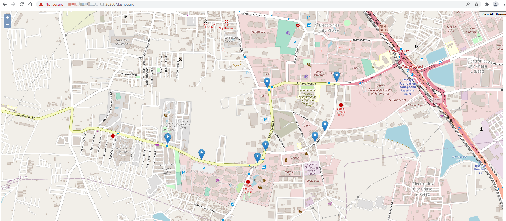

# Intelligent Traffic Management Reference Implementation
## Overview


Intelligent Traffic Management is designed to detect and track vehicles as well
as pedestrians and to estimate a safety metric for an intersection. Object
tracking recognizes the same object across successive frames, giving the ability
to estimate trajectories and speeds of the objects. The reference implementation
also detects collisions and near misses. A real-time dashboard visualizes the
intelligence extracted from the traffic intersection along with annotated video
stream(s).

This collected intelligence can be used to adjust traffic lights to optimize the
traffic flow of the intersection, or to evaluate and enhance the safety of the
intersection by allowing Emergency services notifications, such as 911 calls, to
be triggered by collision detection, reducing emergency response times.

To run the reference implementation, you will need to first configure the
control plane host and the worker node host as presented in
[Prerequisites](#Prerequisites).

Select **Configure & Download** to download the reference implementation and the
software listed below.

>**NOTE:** This software package will not work on the People's Republic of China (PRC) network.

[Configure &
Download](https://software.intel.com/iot/edgesoftwarehub/download/home/ri/intelligent_traffic_management)


-   **Time to Complete:** 30 - 45 minutes
-   **Programming Language:** Python\*
-   **Software:**
    -   Intel® Distribution of OpenVINO™ toolkit 2021 Release
    -   Kubernetes*


## Target System Requirements

### Control Plane

-   One of the following processors:

    - 6th to 12th Generation Intel® Core™ processors with Iris® Pro Graphics or Intel® HD Graphics

-   At least 32 GB RAM.

-   At least 256 GB hard drive.

-   An Internet connection.

-   One of the following operating systems:
    - Ubuntu\* 20.04 LTS Server.
    - Lubuntu\* 20.04 LTS.

### Worker Nodes

-   One of the following processors:

    - 6th to 12th Generation Intel® Core™ processors with Iris® Pro Graphics or Intel® HD Graphics

-   At least 32 GB RAM.

-   At least 256 GB hard drive.

-   An Internet connection.

-   One of the following operating systems:
    - Ubuntu\* 20.04 LTS Server.
    - Lubuntu\* 20.04 LTS.

-   IP camera or pre-recorded video(s).

## How It Works

The application uses the inference engine and the Intel® Deep Learning Streamer (Intel® DL Streamer)
included in the Intel® Distribution of OpenVINO™ toolkit. The solution is
designed to detect and track vehicles and pedestrians and upload cloud data to Amazon Web Services* (AWS*) S3 storage.


Figure 1: How It Works

The Intelligent Traffic Management application requires the services pods,
database and a visualizer. Once the installation is successful, the
application is ready to be deployed using Helm. After the deployment,
the application pod takes in the virtual/real RTSP stream addresses and
performs inference and sends metadata for each stream to the InfluxDB*
database. The visualizer in parallel shows the analysis over the
metadata like pedestrians detected, observed collisions and processed
video feed.

The application has the capability to perform inferences over as much as 20
channels. In addition, the visualizer is capable of showing each feed
separately as well as all the feeds at the same time using Grafana\*. The
user can visualize the output remotely over a browser, provided that
they are in the same network.

New in this release:

*   Fix for RTSP issue where RTSP might not work due to first 10-15 frames that
    are received without data

*   Optimization for Intel® DL Streamer image


Figure 2: Architecture Diagram

## Get Started

### Prerequisites

In order to run the latest version of Intelligent Traffic Management, you will need 2 Linux hosts: one for Kubernetes control plane and one for Kubernetes worker. The following steps describe how to prepare both targets before installing the reference implementation.

1. Install docker-ce and docker-compose. Run the following commands on both targets:

    - Install the latest Docker CLI and Docker daemon by following the Docker
    instructions to [Install using the
    repository](https://docs.docker.com/engine/install/ubuntu/#install-using-the-repository)
    and [Install Docker
    Engine](https://docs.docker.com/engine/install/ubuntu/#install-docker-engine).

    - Run Docker without sudo following the [Manage Docker as a non-root
    user](https://docs.docker.com/engine/install/linux-postinstall/)
    instructions.

    - If your hosts are running behind a HTTP/S proxy server, perform these
    steps. If not, you can skip this step.

        - Configure proxy settings for the Docker\* client to connect to
           internet and for containers to access the internet by following
           [Configure Docker to use a proxy server](https://docs.docker.com/network/proxy/).
    
        - Configure proxy settings for the Docker\* daemon by following
           [HTTP/HTTPS proxy](https://docs.docker.com/config/daemon/systemd/#httphttps-proxy).
 
    - Install the docker-compose tool by following
      [Install Compose](https://docs.docker.com/compose/install/#install-compose).
 
    - Configure the Docker service by adding the following in the
    ``/etc/docker/daemon.json`` file:

        ```bash
        {
            "exec-opts": [
                "native.cgroupdriver=systemd"
            ]
        }
        ```


2. Install Helm. Run the following commands on both targets:
    ```bash
    curl https://baltocdn.com/helm/signing.asc | sudo apt-key add -
    sudo apt-get install apt-transport-https --yes
    echo "deb https://baltocdn.com/helm/stable/debian/ all main" | sudo tee /etc/apt/sources.list.d/helm-stable-debian.list
    sudo apt-get update
    sudo apt-get install helm
    ```

3. Install and configure the Kubernetes cluster. Run the following commands on both targets:

    - Get Google key:
        ```bash
        curl -s https://packages.cloud.google.com/apt/doc/apt-key.gpg | sudo apt-key add
        ```

    - Add kube apt repo:
        ```bash
        echo "deb https://apt.kubernetes.io/ kubernetes-xenial main" >> ~/kubernetes.list
        sudo mv ~/kubernetes.list /etc/apt/sources.list.d
        ```

    - Disable swap on your machine. (Kubernetes cluster doesn't work while using swap memory.)

        ```bash
        sudo swapoff -a
        ```

    - Install Kubernetes binaries:

        ```bash
        sudo apt-get update && sudo apt-get install -yq kubelet=1.23.4-00 kubeadm=1.23.4-00 kubectl=1.23.4-00 kubernetes-cni
        ```


4. Initialize the Kubernetes cluster on the Control Plane machine:

    ```bash
    sudo kubeadm init --pod-network-cidr=10.244.0.0/16
    ```

    >**NOTE:** Save the kube join command prompted at the end of the cluster creation.


5. Configure access to Kubernetes cluster:
    - Current user configuration:

        ```bash
        mkdir $HOME/.kube
        sudo cp -i /etc/kubernetes/admin.conf $HOME/.kube/config
        sudo chown $(id -u):$(id -g) $HOME/.kube/config
        ```

    - Root user configuration:

        ```bash
        sudo su -
        mkdir .kube
        cp -i /etc/kubernetes/admin.conf $HOME/.kube/config
        exit
        ```


6. Add network plugin to your Kubernetes cluster:

    ```bash
    kubectl apply -f https://raw.githubusercontent.com/coreos/flannel/master/Documentation/kube-flannel.yml
    ```

7. Enable kubelet service and check status:

    - Enable kubelet service:
        ```bash
        sudo chmod -R 755 /etc/cni/
        sudo systemctl restart kubelet.service
        ```

    - Check kubelet service status:

        ```bash
        sudo systemctl status kubelet.service
        ```

        The expected status is Active.

8. Check that the current node is ready by using the following command:

    ```bash
    kubectl get nodes -A
    ```

   Output should look like:

    ```bash
    NAME              STATUS   ROLES                  AGE     VERSION
    Machine1          Ready    control-plane,master   1m      v1.23.4
    ```

9. Join Kubernetes worker node:
    - If you didn't save the join command in step 4, run the following command on the control plane to generate another token. (If you have the join command, skip this step.)

        ```bash
        kubeadm token create --print-join-command
        ```

    - Run the kubeadm join command on the worker node, for example:

        ```bash
        kubeadm join <Controller_IP>:6443 --token token12456.token12456 \
           --discovery-token-ca-cert-hash sha256:<sha_of_the_kubernetes_certificate>
        ```

    - If join failed, proceed with the following step and give kubelet access to network policy:

        ```bash
        sudo chmod -R 755 /etc/cni/
        ```

10. Configure Kubernetes on the worker side:
    - Create .kube config folder on worker side:

        ```bash
        mkdir $HOME/.kube
        ```

    - Copy the configuration file from controller to worker node:

        ```bash
        scp /home/controller_user/.kube/config worker_user@worker_ip:/home/worker_user/.kube/
        ```

    - Restart kubelet service:

        ```bash
        sudo systemctl restart kubelet.service
        ```

11. Check that Kubernetes nodes on both machines are ready with the command:

    ```bash
    kubectl get nodes -A
    ```

    Output should look similar to:

    ```bash
    NAME                                    STATUS   ROLES                              AGE     VERSION
    Control-plane-host-name                 Ready    control-plane,master               5m      v1.23.4
    Worker-host-name                        Ready    <unassigned>                       1m      v1.23.4
	```

12. Assign role to the worker node from control-plane host:

    ```bash
    kubectl label node <node_name> node-role.kubernetes.io/worker=worker
    ```

    Check again to see that the label was placed using the following command:

    ```bash
    kubectl get nodes -A
    ```

    Output should look similar to:

    ```bash
    NAME                                    STATUS   ROLES                              AGE     VERSION
    Control-plane-host-name                 Ready    control-plane,master               5m      v1.23.4
    Worker-host-name                        Ready    worker                             1m      v1.23.4
    ```

13. Install required package on worker node:

    ```bash
    sudo apt-get install nfs-kernel-server -y
    ```

14. Install required package on control plane:

    ```bash
    sudo apt-get install jq -y
    ```

>**NOTE:** For local build using Harbor local registry, add the following line in the ``/etc/docker/daemon.json`` configuration file: 
``"insecure-registries": ["https://WORKER_IP:30003"]``


### Step 1: Install the Reference Implementation

>**NOTE:** The following sections may use ``<Controller_IP>`` in a URL
or command. Make note of your Edge Controller’s IP address and
substitute it in these instructions.

Select **Configure &
Download** to download
the reference implementation and then follow the steps below to install
it.

[Configure &
Download](https://software.intel.com/iot/edgesoftwarehub/download/home/ri/intelligent_traffic_management)

1.  Make sure that the [Target System Requirements](#target-system-requirements)
    are met properly before proceeding further.


2.  If you are behind a proxy network, be sure that proxy addresses are configured in the system:

    ```bash
    export http_proxy=proxy-address:proxy-port
    export https_proxy=proxy-address:proxy-port
    ```

3.  Open a new terminal, go to the downloaded folder and unzip the downloaded RI package:
    ```bash
    unzip intelligent_traffic_management.zip
    ```

4.  Go to the ``intelligent_traffic_management/``
    directory.

    ```bash
    cd intelligent_traffic_management
    ```

5.  Change permissions of the executable edgesoftware file to enable
    execution.

    ```bash
    chmod 755 edgesoftware
    ```

6.  Run the command below to install the Reference Implementation:

    ```bash
    ./edgesoftware install
    ```

7.  During the installation, you will be prompted for the AWS Key ID, AWS Secret, AWS Bucket and Product Key.
    The Product Key is contained in the email you received from Intel
    confirming your download.
    AWS credentials are optional. AWS Key ID, AWS Secret and AWS Bucket are obtained after following the steps in the
    [Set Up Amazon Web Services* Cloud Storage](#set-up-amazon-web-services-cloud-storage) section.
    If you do not need the cloud upload feature, simply provide empty values by pressing **Enter** when prompted for the AWS
    credentials.

    > **NOTE:** Installation logs are available at the path:
    >
    > ``/var/log/esb-cli/Intelligent_Traffic_Management_<version>/<Component_Name>/install.log``

    

    Figure 3: Product Key


8.  When the installation is complete, you see the message “Installation
    of package complete” and the installation status for each module.

    

    Figure 4: Installation Success


### Step 2: Check the Application

Check the ``Intelligent_Traffic_Management`` pods with the command:

```bash
kubectl get pod -A
```

You will see output similar to:


Figure 5: Intelligent Traffic Management Pods Status

>**NOTE:** If the pods have a status of **ContainerCreating**, please wait
for some time, since Kubernetes will pull the images from the registry
and then deploy them. This happens only the first time the containers
are deployed, and the wait time will depend upon the network bandwidth
available.

### Step 3: Data Visualization on Grafana

1.  Navigate to https://Controller_IP:30300/dashboard on your browser
    to check the Intelligent Traffic Management dashboard.

    

    Figure 6: Login to Intelligent Traffic Management Dashboard

2.  Navigate to https://Controller_IP:30303/camera/0 on your browser
    to check the camera.

    

    Figure 7: Intelligent Traffic Management Camera 0

    

    Figure 8: Intelligent Traffic Management Dashboard

3.  Navigate to **&lt;Controller_IP&gt;:32000** on your
    browser to login to the Grafana dashboard.

4.  Get **Grafana Password** with the command:

    ```bash
    kubectl get secrets/grafana -n default -o json | jq -r '.data."admin-password"' | base64 -d
    ```

5.  Login with user as **admin** and password as **Grafana Password**.

6.  Click **Home** and select the **ITM** to open the main dashboard.

    

    Figure 9: Grafana Home Screen

    

    Figure 10: Grafana Dashboard List

    An example of the Intelligent Traffic Management dashboard:

    

    Figure 11: Grafana Main Dashboard – Intelligent Traffic Management

The above dashboard shows the number of vehicles, pedestrians and
collisions detected on the left side. These may be used for adjusting
traffic lights and calling emergency services if collisions are
detected.

The blue drop pins on the Map are the geographic coordinates of camera.
By clicking on these pins, a small window of the camera feed can be
visible with the detection results, as shown in the figure below.


Figure 12: Detection Results on MapUI

To open the Grafana Dashboard for a particular camera with the detection
results and other data metrics, click on the camera feed on the small
window, as shown in the figure below.

>**NOTE:** To close the small window with camera feed, click the close button
(X) on the top left corner of the window.


Figure 13: Grafana Dashboard of an Individual Camera Feed

To view the detection results of all the configured camera feeds, click
on **View All Streams** from the top right corner on the MapUI from the main
Grafana Dashboard i.e. ITM. Refer to Figure 11, Grafana Main Dashboard –
Intelligent Traffic Management.


Figure 14: Detection Results of all the Configured Camera Feeds

>**NOTE:** To open combined streams in full tab, go to: ``https://<Controller_IP>:30303/get_all_streams``

If the AWS credentials were provided during the installation steps, then you enabled the Cloud Upload feature. 

Navigate to the configured AWS storage to find the uploaded video captures.


Figure 15: List of AWS S3 Bucket Objects


Figure 16: AWS S3 Bucket Object Properties


Figure 17: AWS S3 Bucket Object Photo

### Step 4: Uninstall the Application

1.  Check installed modules with the following command:
    ```bash
    cd <install_location>/intelligent_traffic_management
    ./edgesoftware list
    ```

    All installed modules will show as seen in the screen below:

    

    Figure 18: Installed Modules List

2.  Run the command below to uninstall all the modules:

    ```bash
    ./edgesoftware uninstall –a
    ```

3.  Run the command below to uninstall the Intelligent Traffic Management reference implementation:

    ```bash
    ./edgesoftware uninstall <itm-id get from step 1>
    ```

    

    Figure 19: Uninstalled Modules


### Public Helm Registry for Helm Charts

Installation of Intelligent Traffic Management Reference Implementation on local Kubernetes Cluster is accomplished using Helm charts. In earlier releases, Helm charts used to be a part of Reference Implementation installation package. Now a global Helm repo is issued
so that Reference Implementation Helm charts can be accessible from private and public networks. This will speed up and
ease the process of introducing updates and their integration with Reference Implementations.

## Local Build Instructions

After you have installed Kubernetes Cluster from [Prerequisites](#Prerequisites), you can build your own Intelligent Traffic Management Docker image using the following instructions.

You can proceed with the steps presented using either edgesoftware sources or GitHub sources: [Intelligent Traffic Management](http://www.github.com/intel/intelligent-traffic-management)

### Setup
Change the directory to repository path with one of the following options.

For GitHub:

```bash
git clone https://github.com/intel/intelligent-traffic-management.git
cd intelligent_traffic_management/
git checkout --track origin/2022.2
```

Add the following line in the ``/etc/docker/daemon.json`` configuration file: 
```bash
"insecure-registries": ["https://WORKER_IP:30003"]
```

Restart the Docker service:

```bash
sudo systemctl daemon-reload
sudo systemctl restart docker
```

>**NOTE:** You must check that the pods are ready and restarted after each
>Docker service restart.


If the edgesoftware installation was not executed, install Grafana and local Harbor registry using the below commands.


- Grafana steps:
    ```bash
    cd intelligent_traffic_management/deploy_grafana
    chmod +x install_grafana_in_kube.sh
    sudo ./install_grafana_in_kube.sh -c <Controller_IP> -n <Worker_IP> -p <proxy>
    ```

- Harbor Helm install command:

    ```bash
    helm repo add harbor https://helm.goharbor.io
    helm install harbor harbor/harbor --set expose.type=nodePort \
    --set expose.tls.auto.commonName=harbor_cert \
    --set externalURL=https://<WORKER_IP>:30003 \
    --set persistence.enabled=false \
    --set proxy.http_proxy=<HTTP_PROXY> \
    --set proxy.https_proxy=<HTTPS_PROXY> \
    --set proxy.noProxy=127.0.0.1\\,localhost\\,.local\\,.internal\\,WORKER_IP\\,CONTROLLER_IP
    ```


Use your preferred text editor to make the following file updates.

In the next steps, the tag `<REPOSITORY_PATH>` indicates the path to the repository.

In the Change examples, replace the line indicated by **-** with the line indicated by **+**

1. `<REPOSITORY_PATH>/src/build_images.sh` - update the tag and version for the image.

    ```bash
    Change example:
    -    TAG="5.0"
    +    TAG="5.1"
    ```

2. `<REPOSITORY_PATH>/deploy/services/values.yaml` - update image deployment harbor.

    ```bash
    Change example:
    - images:
    -   registry: ""
    + images:
    +   registry: <local harbor host>:<local_harbor_port>/library/
    ```

3. `<REPOSITORY_PATH>/deploy/services/values.yaml` - update version.

    ```bash
    Change example:
    - images:
    -   tag: "5.0"
    + images:
    +   tag: "5.1"
    ```

    Make sure the tag is identical to the tag used on ``build_images.sh`` script.


### Build and Install

Build the Docker image with the following commands:

```bash
# Login on your Harbor Docker registry
docker login WORKER_IP:30003
user: admin
password: Harbor12345
cd <REPOSITORY_PATH>/src/
./build_images.sh -c worker_ip   # The local Docker image will be built on the Ubuntu machine.
```

Install ITM application with the following commands:

1. Get Grafana password:

    ```bash
    kubectl get secrets/grafana -n default -o json | jq -r '.data."admin-password"' | base64 -d
    ```

2. Get Grafana service IP using the following command:

    ```bash
    kubectl describe service -n default grafana |grep -i Endpoint
    ```

3. Get the host IP using the following command:

    ```bash
    hostname -I | awk '{print $1}'
    ```

4. Change directory to deployment directory from repository path:

    ```bash
    cd <REPOSITORY_PATH>/deploy/
    ```

5. Deploy the MQTT broker and wait for it to initialize:

    ```bash
    helm install broker broker/ --set namespace=default
    kubectl wait --namespace=default --for=condition=Ready pods --timeout=600s --selector=app=hivemq-cluster1
    ```


6. Using the host IP, Grafana service IP and password from steps 1 and 2, run the following Helm installation command:

    ```bash
    helm install itm services/ --wait --timeout 10m \
          --set grafana.password=<Grafana_Password> \
          --set grafana.ip=<Grafana_PodIP> \
          --set host_ip=<Controller_IP> \
          --set namespace=default \
          --set proxy.http=<HTTP_PROXY> \
          --set proxy.https=<HTTPS_PROXY> \
          --set cloud_connector.aws_key=<AWS_KEY_ID> \
          --set cloud_connector.aws_secret=<AWS_SECRET> \
          --set cloud_connector.aws_bucket=<AWS_BUCKET> \
          --set cloud_connector.aws_region=<AWS_S3_REGION>
    ```

>**NOTES:**
>
>1. If your host is not behind a firewall, then skip setting the http and https proxy.
>
>2. Cloud connector requires your AWS credentials to connect to it to upload video captures in case of collision,
>near miss and overcrowd events. If you don't want this feature enabled, then skip setting these parameters.
>For instructions on how to configure AWS, refer to the [Set Up Amazon Web Services* Cloud Storage](#set-up-amazon-web-services-cloud-storage) section.

After step 6 completes, use your preferred browser to access ITM at: ``https://Controller_IP:30300`` and
Grafana at: ``https://Controller_IP:32000``.

## Single Node Deployment

### Prerequisites

Be sure you have completed the items below before continuing.

#### Proxy Settings

If you are not behind a proxy network, skip this section.

If you are behind a proxy network, check that proxy addresses are configured in
the system. An example of configuring the proxy environment is shown below.

Edit the ``/etc/environment`` file for proxy configuration.

```bash
sudo gedit /etc/environment
```

Reboot your system for the new changes to take place.

#### Install and Configure Docker*

Follow the below steps to continue installation for Docker* CE using the
repository.

1.  Follow the Docker instructions to [Install using the repository](https://docs.docker.com/engine/install/ubuntu/#install-using-the-repository).

2.  Follow the Docker instructions to [Install Docker engine](https://docs.docker.com/engine/install/ubuntu/#install-docker-engine).

3.  **(OPTIONAL)** If you are running behind a proxy, follow the Docker instructions to [configure Docker to use a proxy server](https://docs.docker.com/network/proxy/) and [Docker daemon HTTP/HTTPS proxy](https://docs.docker.com/config/daemon/systemd/#httphttps-proxy).

4.  Follow the Docker instructions to [Manage Docker as a non-root user](https://docs.docker.com/engine/install/linux-postinstall/).

5.  Follow the Docker instructions to [Install docker compose on Ubuntu using
    the repository](https://docs.docker.com/compose/install/linux/#install-using-the-repository).

6.  Configure the Docker service:

    - Add the following line to ``/etc/docker/daemon.json`` file.

        ```bash
        "insecure-registries": ["https://WORKER_IP:30003"]
        ```

    - Restart the Docker service for the changes to take place.

        ```bash
        sudo systemctl daemon-reload
        sudo systemctl restart docker
        ```

#### Install Helm

Follow the below steps to install the Helm component. If you are running
behind a corporate proxy, be sure the proxy is set up correctly. For details, see [Proxy Settings](#proxy-settings).

```bash
  curl <https://baltocdn.com/helm/signing.asc | sudo apt-key add
  sudo apt-get install apt-transport-https –y
  echo "deb <https://baltocdn.com/helm/stable/debian/> all main" | sudo tee /etc/apt/sources.list.d/helm-stable-debian.list
  sudo apt-get update
  sudo apt-get install helm
```

#### Install and Configure Kubernetes Cluster

Follow the steps below to install and configure the Kubernetes cluster on the system.

>**NOTE:** If the system is rebooted or powered off, you must repeat step 2 to
>disable swap.

1.  Set up the Kubernetes environment for installation:

    ```bash
    curl -s https://packages.cloud.google.com/apt/doc/apt-key.gpg | sudo apt-key add
    echo "deb <https://apt.kubernetes.io/> kubernetes-xenial main" ~/kubernetes.list
    sudo mv ~/kubernetes.list /etc/apt/sources.list.d
    ```

2.  Disable swap on the system:

    ```bash
    sudo swapoff -a
    ```

3.  Install kubelet, kubeadam, kubectl and Kubernetes-cni:

    ```bash
    sudo apt-get update && sudo apt-get install -yq
    kubelet=1.23.4-00 kubeadm=1.23.4-00 kubectl=1.23.4-00
    kubernetes-cni
    ```

4.  Initialize the Kubernetes cluster on the machine:

    ```bash
    sudo kubeadm init --pod-network-cidr=10.244.0.0/16
    ```

5.  Configure access for the Kubernetes cluster for user:

    ```bash
    mkdir -p $HOME/.kube
    sudo cp -i /etc/kubernetes/admin.conf $HOME/.kube/config
    sudo chown $(id -u):$(id -g) $HOME/.kube/config
    ```

6.  Configure access for the Kubernetes cluster for Root user:

    ```bash
    sudo su -
    mkdir .kube
    cp -i /etc/kubernetes/admin.conf $HOME/.kube/config
    exit
    ```

7.  Add the network plugin to the Kubernetes cluster:

    ```bash
    kubectl apply -f https://raw.githubusercontent.com/coreos/flannel/master/Documentation/kube-flannel.yml
    ```

8.  Enable the Kubernetes service:

    ```bash
    sudo systemctl restart kubelet.service
    sudo chmod -R 755 /etc/cni/
    ```

### Install ITM on Single Node Deployment

The below steps describe how to install the Intelligent Traffic
Management Reference Implementation on a single node.

If you are running behind a corporate proxy, please ensure the proxy is set up
correctly. For details, see [Proxy Settings](#proxy-settings).

#### Enable Kube Cluster on the Machine

Enable kube cluster setup on the machine with the command:

```bash
kubectl taint nodes --all node-role.kubernetes.io/control-plane node-role.kubernetes.io/master-
```

#### Install and Run ITM Reference Implementation

Install the ITM reference implementation on the machine with these commands:

1.  Clone the ITM GitHub repository:

    ```bash
    git clone https://github.com/intel/intelligent-traffic-management.git
    cd intelligent_traffic_management/
    git checkout --track origin/2022.2
    ```

2.  Install Grafana in Kube using the script on the repository. Replace
    the IP with the current system IP and use the proxy parameter if you are running behind a proxy.

    ```bash
    cd intelligent_traffic_management/deploy_grafana
    chmod +x install_grafana_in_kube.sh
    sudo ./install_grafana_in_kube.sh -c <IP> -n <IP> -p <proxy>
    ```

    

    Figure 20: Grafana Install on Single Node

3.  Get the Grafana service IP and Password for the deployment:

    ```bash
    kubectl describe service -n default grafana |grep -i Endpoint
    kubectl get secrets/grafana -n default -o json | jq -r '.data."admin-password"' | echo `base64 -d `
    ```

4.  Add the ``intel`` Helm repository:

    ```bash
    helm repo add intel https://intel.github.io/helm-charts
    helm repo update
    ```

5.  Install the ITM ``hivemq`` mqtt broker:

    ```bash
    helm install broker intel/itm-mqtt-broker
    watch -n 0.2 kubectl get pods -A
    ```

    Before proceeding with the next step, ensure itm-mqtt broker pods named
    ``hivemq-`` are in the running state.

    

    Figure 21: HiveMQ* Pods Ready

6.  Install the ITM application and change the Grafana password, Grafana
    IP, and host IP using the information from the previous few
    steps.

    If you are running behind a corporate proxy, use the ``--set proxy.http``
    and ``--set proxy.https`` parameters, otherwise you can skip those settings.

    The ``--set num_video_instance`` parameter is optional. The default value is 8.
    You can change the value to the number of instances that you want to use.

    ```bash
    helm install --wait --timeout 20m itm intel/itm-services \
          --set grafana.password=<Grafana_Password> \
          --set grafana.ip=<Grafana_PodIP> \
          --set images.registry=intel/ \
          --set host_ip=<SYSTEM_IP> \
          --set namespace=default \
          --set proxy.http=<HTTP_PROXY> \
          --set proxy.https=<HTTPS_PROXY> \
          --set cloud_connector.aws_key=<AWS_KEY_ID> \
          --set cloud_connector.aws_secret=<AWS_SECRET> \
          --set cloud_connector.aws_bucket=<AWS_BUCKET> \
          --set cloud_connector.aws_region=<AWS_S3_REGION> \
          --set num_video_instance=8
    ```

    

    Figure 22: Intelligent Traffic Management Install Success Output

7.  Check the installation:

    ```bash
    kubectl get pods -n default
    ```

    

    Figure 23: Intelligent Traffic Management Pods in Running State

8.  Access the dashboard and Grafana, change the HOST_IP accordingly.
    Login to Grafana using the ***admin*** as username and password
    generated from the previous step.

    Dashboard link: ``https://Controller_IP:30300/dashboard``

    

    Figure 24: Intelligent Traffic Management Dashboard

    Grafana link: ``https://HOST_IP:32000``

    

    Figure 25: Intelligent Traffic Management Grafana Dashboard


## Optional Steps

### Configure the Input

The Helm templates contain all the necessary configurations for the cameras.

If you wish to change the input, edit the ``./deploy/services/values.yaml`` file and
add the video inputs to the ``test_videos`` array:
```bash
itm_video_inference:
  name: "itm-video-inference"
  topic:
    publisher: "camera"
  test_videos:
    - uri: "file:///app/test_videos/video_car_crash.avi"
    - uri: "file:///app/test_videos/video_pedestrians.avi"
```

To use camera stream instead of video, replace the video file
name with: ``/dev/video0``

To use RTSP stream instead of video, replace the video file name
with the RTSP link: ``- uri: "rtsp://<RTSP_IP>:8554/mystream"``

Each ITM Video Inference service will pick a video input in the order above.

If you wish to change the coordinates, address and the analytics type of the cameras, edit
the ``./deploy/services/templates/itm-analytics-configmap.yaml`` file:


-   **address:** Name of the camera’s geographic location. Must be a
    non-empty alphanumeric string.

-   **latitude:** Latitude of the camera’s geographic location.

-   **longitude:** Longitude of the camera’s geographic location.

-   **analytics:** Attribute to be detected by the model.

    >**NOTE:** The default model supports pedestrian, vehicle and bike
    detection. You can select desired attributes from these, e.g.,
    "analytics": "pedestrian vehicle detection".


### Stop the Application

To remove the deployment of this reference implementation, run the
following commands.

>**NOTE:** The following commands will remove all the running pods and
the data and configuration stored in the device, except the MQTT Broker.

```bash
helm delete itm
```

If you wish to remove the MQTT Broker also, enter the command:

```bash
helm delete broker
```

## Set Up Amazon Web Services Cloud* Storage

To enable Cloud Storage on the installed Reference Implementation, you
will need Amazon Web Services\* (AWS*) paid/free subscription to enable
your root user account that has to support the following services:


-  Identity and Access Management (IAM)
-  Amazon S3 Bucket


After finishing the setup for IAM and S3, you will have your
``AWS_KEY_ID``, ``AWS_SECRET_KEY`` and ``AWS_BUCKET_NAME`` to be used
on your Intelligent Traffic Management
Cloud Connector - Configuration.


### References


-  [AWS IAM Official Documentation](https://docs.aws.amazon.com/IAM/latest/UserGuide/introduction.html)
-  [AWS IAM Create and Setup Official Documentation](https://docs.aws.amazon.com/IAM/latest/UserGuide/id_users_create.html)


### Setup Steps


1. From your AWS management console, search for IAM and open the IAM Dashboard.

   

   Figure 26: IAM Dashboard

2. On the left menu of the dashboard, go to **Access management** and
   click on **Users** to open the IAM Users tab.

   

   Figure 27: IAM Users Tab

3. From the IAM users tab, click on **Add User** to access the AWS add
   user setup.

4. On the first tab, provide the username and select the AWS credentials
   type to be **Access key**.

   

   Figure 28: Set User Details Tab

5. On the second tab, create a group to attach policies for the new IAM
   user.

   a. Search for S3 and select **AmazonS3FullAccess** policy.

   b. Click on **Create group**.

      

      Figure 29: Create Group Tab

6. Select the group you have created and click on **Next: Tags**.

7. Tags are optional. If you don't want to add tags, you can continue to
   the Review tab by clicking on **Next: Review**.

8. After review, you can click on the **Create User** button.

9. On this page, you have access to AWS Key and AWS Secret Access key.
   (Click on **Show** to view them.)

   a. Save both of them to be used later on your Cloud Data -
      Configuration on the Edge Insights for Fleet Reference
      Implementation you have installed.

     >**NOTE:** The AWS Secret Key is visible only on this page, you cannot get
         the key in another way.


   b. If you forget to save the AWS Secret Key, you can delete the last key and
      create another key.

      

      Figure 30: AWS Key and Secret Access Key

10. After you have saved the keys, close the tab. You are returned to the
   IAM Dashboard page.


11. Click on the user created and save the **User ARN** to be used on S3
   bucket setup.


>**NOTE:**
      If you forget to save the AWS Secret key from the User tab,
      you can select **Security Credentials**, delete the Access Key and
      create another one.


### S3 Bucket

S3 Bucket Service offers cloud storage to be used on cloud based
applications.

Perform the steps below to set up S3 Bucket Service.

1. Open the Amazon Management Console and search for Amazon S3.

2. Click on **S3** to open the AWS S3 Bucket dashboard.
   

   Figure 31: AWS S3 Bucket Dashboard

3. On the left side menu, click on **Buckets**.

4. Click on the **Create Bucket** button to open the Create Bucket
   dashboard.

5. Enter a name for your bucket and select your preferred region.
   

   Figure 32: Create Bucket General Configuration

6. Scroll down and click on **Create Bucket**.

7. From the S3 Bucket Dashboard, click on the newly created bucket and
   go to the **Permissions** tab.

8. Scroll to **Bucket Policy** and click on **Edit** to add a new
   statement in statements tab that is already created to deny all the
   uploads.
   

   Figure 33: Edit Bucket Policy

9. You must add a comma before adding the following information.
    ```bash
    {
      "Sid": "<Statement name>",
      "Effect": "Allow",
      "Principal": {
          "AWS": "<User_ARN_Saved>"
      },
      "Action": "s3:*",
      "Resource": [
          "arn:aws:s3:::<bucket_name>",
          "arn:aws:s3:::<bucket_name>/*"
      ]
    }
    ```
    
    a. Update with the following statement with statement name, your user
      ARN saved at IAM setup - step 11 and your bucket name.

    b. Click on **Save changes**. If the change is successful, you will
     see a **success saved** message, otherwise you need to re-analyze
     the json file to fix the error.


## Summary and Next Steps

This application successfully leverages Intel® Distribution of
OpenVINO™ toolkit plugins for detecting and tracking vehicles and
pedestrians and estimating a safety
metric for an intersection. It can be extended further to provide
support for a feed from a network stream (RTSP or camera device).

As a next step, you can experiment with accuracy/throughput trade-offs
by substituting object detector models and tracking and collision
detection algorithms with alternative ones.


## Create a Microsoft Azure* IoT Central Dashboard 

As a next step, you can create an Azure* IoT Central dashboard for this
reference implementation, run standalone Python code to fetch telemetry
data from InfluxDB, and send data to the Azure IoT Central dashboard
for visualizing telemetry data. See
[Connect Edge Devices to Azure IoT*](http://software.intel.com/content/www/us/en/develop/articles/connect-devices-to-azure-iot.html#itm)
for instructions.


## Learn More

To continue your learning, see the following guides and software
resources:

-   [Intel® Distribution of OpenVINO™ toolkit
    documentation](https://docs.openvinotoolkit.org/2021.1/index.html)
-   [Intel® DL Streamer documentation](https://docs.openvino.ai/latest/openvino_docs_dlstreamer.html#doxid-openvino-docs-dlstreamer)

## Troubleshooting

### Pods status check

Verify that the pods are **Ready** as well as in **Running** state
using below command:

```bash
kubectl get pods -A
```

If any pods are not in **Running** state, use the following command to get
more information about the pod state:

```bash
kubectl describe -n default pod <pod_name>
```

### ITM Dashboard Not Showing on Browser After Restart Server

Run the following commands:

```bash
# Get Grafana pod ip
kubectl get pod -n default -owide |grep grafana* 
grafana-8465558bc8-5p65x            3/3     Running   24 (5h23m ago)   12d   10.245.179.203

#update ITM yaml file
kubectl set env itm -n default GRAFANA_HOST=10.245.179.203
```

### Pod status shows “ContainerCreating” for long time

If Pod status shows **ContainerCreating** or **Error** or **CrashLoopBackOff** for 5 minutes or more, run the following commands:

```bash
reboot
su
swapoff -a
systemctl restart kubelet  # Wait till all pods are in “Running” state.
./edgesoftware install
```

### Subprocess:32 issue

If you see any error related to subprocess, run the command below:

`pip install --ignore-installed subprocess32==3.5.4`


### Support Forum

If you're unable to resolve your issues, contact the [Support
Forum](https://software.intel.com/en-us/forums/intel-edge-software-recipes).

To attach the installation logs with your issue, execute the command below to consolidate a list
of the log files in tar.gz compressed format, e.g., **ITM.tar.gz**.


`tar -czvf ITM.tar.gz /var/log/esb-cli/Intelligent_Traffic_Management_<version>/Component_name/install.log`
